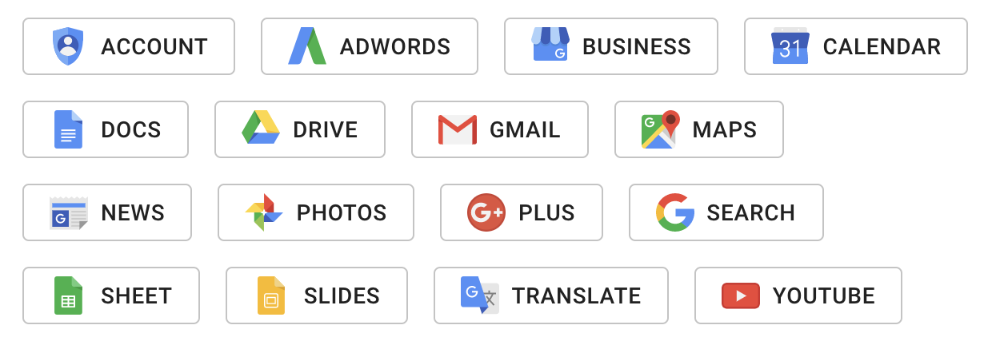

# Material UI Google icons

This is free to use set of google style flat icons wrapped in Material UI lib

## Installation

```bash
npm install @trejgun/material-ui-icons-google
```

## Usage

```typescript
import React, { FC } from "react";
import {Grid, Button, makeStyles} from "@material-ui/core";

import {
  Account,
  Adwords,
  Business,
  Calendar,
  Docs,
  Drive,
  Gmail,
  Maps,
  News,
  Photos,
  Plus,
  Search,
  Sheet,
  Slides,
  Translate,
  Youtube,
} from "@trejgun/material-ui-icons-google";


const useStyles = makeStyles(
 theme => ({
   button: {
     margin: theme.spacing(1),
   },
   icon: {
     marginRight: theme.spacing(1),
   },
 }),
 {name: "Demo"}
);


const Demo: FC = () => {
  const classes = useStyles();

  return (
    <Grid>
      <Button variant="outlined" className={classes.button}>
        <Account className={classes.icon} /> Account
      </Button>
      <Button variant="outlined" className={classes.button}>
        <Adwords className={classes.icon} /> Adwords
      </Button>
      <Button variant="outlined" className={classes.button}>
        <Business className={classes.icon} /> Business
      </Button>
      <Button variant="outlined" className={classes.button}>
        <Calendar className={classes.icon} /> Calendar
      </Button>
      <Button variant="outlined" className={classes.button}>
        <Docs className={classes.icon} /> Docs
      </Button>
      <Button variant="outlined" className={classes.button}>
        <Drive className={classes.icon} /> Drive
      </Button>
      <Button variant="outlined" className={classes.button}>
        <Gmail className={classes.icon} /> Gmail
      </Button>
      <Button variant="outlined" className={classes.button}>
        <Maps className={classes.icon} /> Maps
      </Button>
      <Button variant="outlined" className={classes.button}>
        <News className={classes.icon} /> News
      </Button>
      <Button variant="outlined" className={classes.button}>
        <Photos className={classes.icon} /> Photos
      </Button>
      <Button variant="outlined" className={classes.button}>
        <Plus className={classes.icon} /> Plus
      </Button>
      <Button variant="outlined" className={classes.button}>
        <Search className={classes.icon} /> Search
      </Button>
      <Button variant="outlined" className={classes.button}>
        <Sheet className={classes.icon} /> Sheet
      </Button>
      <Button variant="outlined" className={classes.button}>
        <Slides className={classes.icon} /> Slides
      </Button>
      <Button variant="outlined" className={classes.button}>
        <Translate className={classes.icon} /> Translate
      </Button>
      <Button variant="outlined" className={classes.button}>
        <Youtube className={classes.icon} /> Youtube
      </Button>
    </Grid>
  );
};
```

## How it looks like



## Image source

[FlatIcon](https://www.flaticon.com/packs/google-2)
